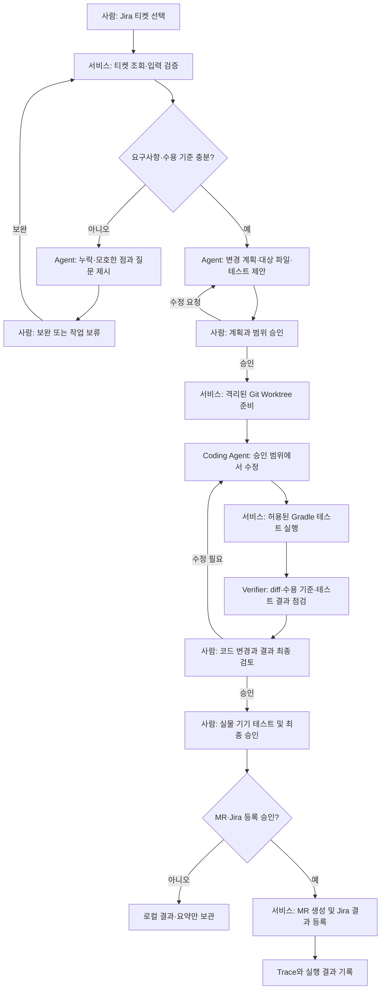

# 2 Week - 문제 정의 및 서비스 기획

## 프로젝트 개요

이미 운영 중인 Android 앱의 유지보수 과정에서 개발자가 Jira 티켓을 읽고 요구사항을 정리한 뒤, 코드를 수정하고 Gradle 테스트를 수행하며 결과를 Jira와 MR에 정리하는 반복 업무를 줄이려는 프로젝트입니다. 로컬 Web UI에서 작업을 선택하고, Coding Agent가 격리된 Git Worktree에서 변경을 수행하며, 테스트와 변경사항을 개발자가 확인한 다음 승인된 결과를 등록하는 흐름을 목표로 합니다.

성공 목표는 기존 방식 대비 개발 작업 시간을 30% 이상 줄이고, 정의된 전체 개발 단계 중 반복 작업의 60% 이상을 자동 처리하는 것입니다. 자동화율만 높이기보다, 변경 범위 준수·테스트 결과·개발자 수정 부담을 함께 확인해야 합니다. 실물 기기 테스트와 최종 승인은 개발자가 수행하는 범위로 유지합니다.

## 나의 멘토 가이드

Agent를 붙이는 것부터 시작하기보다, 최근 완료한 유지보수 티켓 몇 건을 골라 개발자가 실제로 거치는 단계를 먼저 적어 보시면 좋겠습니다. 티켓 확인, 요구사항·수용 기준 정리, 수정 계획, 코드 변경, 테스트, diff 검토, MR 작성과 Jira 결과 등록 중 어떤 단계가 반복적이고 어떤 단계에서 사람의 판단이 꼭 필요한지 구분해야 자동화 범위가 선명해집니다.

특히 코드 수정 Agent에는 저장소 전체를 무제한으로 맡기기보다, 작업 티켓과 관련 파일·테스트 범위를 먼저 제안하게 하고 개발자가 계획을 확인한 뒤 격리된 Git Worktree에서 작업하도록 설계하는 것을 권합니다. Gradle 테스트처럼 실행 규칙이 분명한 일은 자동화하되, 테스트 실패를 숨기거나 임의로 범위를 넓혀 고치지 않도록 해 주세요. MR 생성이나 Jira 상태·댓글 등록도 코드 변경과 분리하고, 변경 내용과 테스트 결과를 사람이 확인한 다음 진행하는 승인 지점을 두는 편이 안전합니다.

평가를 위해서는 최종 코드만 저장하지 말고 어떤 티켓을 입력으로 받았는지, Agent가 어떤 계획과 파일 변경을 만들었는지, 어떤 명령과 테스트를 수행했으며 무엇이 통과·실패했는지 추적할 수 있어야 합니다. 이 기록은 자동화가 시간을 줄였는지뿐 아니라, 개발자가 되돌리거나 수정한 부분과 실패 원인을 파악하는 데 필요합니다. 다만 실행 로그에 토큰·환경 변수·개인정보가 남지 않도록 범위를 정하고, 삭제나 덮어쓰기 등 위험한 명령은 승인 없이 실행되지 않도록 통제해 주세요.

## 1. 총평

Jira 분석부터 코드 수정, Gradle 테스트, Git 변경사항과 MR·Jira 결과 정리까지 유지보수 업무의 주요 단계가 한 흐름으로 묶여 있어 자동화 과제가 분명합니다. 로컬 Web UI와 Git Worktree를 범위에 포함하고, 실물 기기 테스트와 최종 승인을 개발자에게 남긴 점도 현실적인 출발점입니다.

다음 단계에서는 **어떤 유형의 티켓을 자동화 대상으로 삼을지**, **요구사항을 코드 변경 계획으로 바꾸는 과정에서 무엇을 승인받을지**, **Agent가 만든 변경을 어떤 기준으로 안전하게 검증할지**를 구체화하면 좋겠습니다. 정형적인 티켓 정보 수집, 브랜치·Worktree 준비, 허용된 Gradle 명령 실행, 결과 템플릿 작성은 일반 서비스로 처리하고, 요구사항 해석이나 수정 방향 제안, 코드 생성처럼 맥락 판단이 필요한 부분에 Coding Agent를 제한적으로 활용하는 구성을 권장합니다. PoC의 핵심은 모든 개발을 자율 수행하는 것이 아니라 반복 단계를 줄이면서 개발자가 변경을 이해하고 통제할 수 있게 하는 것입니다.

## 2. 먼저 구체화할 사항

- **자동화 대상 티켓**: 초기에는 재현 가능한 버그 수정이나 작은 기능 개선처럼 범위가 제한된 유형을 선택합니다. UI 전면 개편, 대규모 구조 변경, 요구사항이 모호한 티켓은 PoC에서 제외하거나 분석·계획 제안까지만 수행하는 방안을 검토합니다.
- **Jira 티켓 입력 계약**: 필수 필드, 수용 기준, 대상 앱·모듈, 우선순위, 재현 절차, 첨부 정보 중 무엇을 Agent 입력으로 사용할지 정합니다. 누락되거나 상충하는 요구사항은 코드를 추측해 작성하지 않고 질문 또는 보류 상태로 반환해야 합니다.
- **작업 범위와 승인 지점**: Agent가 수정 가능한 저장소와 파일 범위, 의존성 변경 허용 여부, 계획 승인 시점, 테스트 후 diff 승인 시점, MR·Jira 등록 승인 시점을 정합니다. 사용자 승인은 UI 표시만으로 끝내지 말고 서버 측 상태 전이에서도 강제해야 합니다.
- **안전한 실행 환경**: Git Worktree 생성·정리 규칙, 브랜치 이름, 동시 작업 충돌, 허용 명령 목록, 네트워크 접근과 파일 시스템 경계를 정의합니다. 기본 경로는 기존 작업 디렉터리와 분리하고, 위험하거나 되돌리기 어려운 명령은 차단 또는 별도 승인을 요구합니다.
- **테스트 기준과 한계**: Gradle task 중 어떤 것을 실행할지, 단위·정적 검사·빌드 실패를 어떻게 분류할지, 테스트 미실행과 실패를 결과에 어떻게 표시할지 정합니다. 로컬 테스트 통과가 실물 기기·운영 환경의 정상 동작을 보장하지 않는다는 점을 분명히 해야 합니다.
- **기준선과 평가 데이터**: 과거 티켓을 난이도와 유형별로 나누고, 수작업 처리 시간과 재작업을 측정합니다. 동일하거나 유사한 난이도의 작업을 기존 방식과 Agent 방식으로 비교하고, 개발 시간뿐 아니라 리뷰 수정량·테스트 실패·범위 이탈도 함께 기록합니다.
- **자동화율의 산식**: 전체 개발 단계를 무엇으로 볼지, 단계별 자동 완료·사람 승인 후 완료·수동 처리의 구분을 정합니다. 단순히 Agent가 시도한 단계를 자동 처리로 세지 말고, 사람이 실질적으로 다시 수행한 단계는 수동 또는 부분 자동으로 집계합니다.
- **MVP 경계**: 로컬 Web UI, Jira 연동, Codex 기반 수정, Worktree, Gradle 테스트 결과 확인에 집중합니다. Claude·Antigravity 연동, RAG History 검색, 계정 관리와 고도화된 Policy Engine은 제외 범위로 유지하고, MR·Jira 쓰기 작업은 승인 및 실패 복구 방식을 확인한 뒤 연결합니다.

## 3. 권장 Agent 구성

| 구성 요소 | 담당 역할 | 제한 사항 |
|---|---|---|
| Workflow Controller (일반 서비스) | 작업 상태 관리, API 입력 검증, 승인 단계와 Agent 실행 순서 제어 | 권한·승인·상태 전이는 LLM의 판단에 맡기지 않고 서버 로직으로 강제합니다. |
| Jira Collector (일반 서비스) | 허용된 Jira 티켓과 관련 메타데이터 조회·정규화 | 필요한 프로젝트·필드만 읽고, 티켓에 포함된 텍스트는 신뢰할 수 없는 입력으로 취급합니다. |
| Requirement Analyst (선택적 Agent) | 티켓을 요약하고 요구사항, 수용 기준, 누락·모호한 부분을 구조화 | 모호함을 임의로 채우지 않고 확인 질문과 근거를 제시합니다. 이 단계에서는 코드를 수정하지 않습니다. |
| Planner / Coding Agent | 승인된 티켓과 계획을 바탕으로 Worktree 안에서 코드·테스트 변경 제안 및 구현 | 허용된 저장소·경로와 도구만 사용합니다. 비밀정보 접근, 승인되지 않은 범위 확장, 무단 커밋·푸시는 금지합니다. |
| Test Runner (일반 서비스) | 허용된 Gradle task를 실행하고 종료 코드·요약·테스트 리포트 경로 수집 | 명령과 시간·리소스 상한을 제한합니다. 실패를 성공으로 바꾸거나 임의로 테스트를 생략하지 않습니다. |
| Change Reviewer / Verifier (선택) | 티켓 수용 기준과 diff·테스트 결과를 대조하고 누락·범위 이탈을 표시 | 보조 검토 결과이며 최종 코드 리뷰나 승인으로 간주하지 않습니다. 직접 MR을 발행하지 않습니다. |
| MR·Jira Publisher (일반 서비스) | 승인된 변경사항의 MR 생성 및 Jira 결과·링크 등록 | 쓰기 작업 전 승인, 중복 방지, 요청 타임아웃 후 등록 여부 확인을 구현합니다. PoC에서 자동 등록이 위험하면 초안만 제공합니다. |
| Trace·결과 기록 서비스 | 입력 티켓, 계획, 변경 파일, 실행 명령, 테스트 결과, 승인·수정 이력 기록 | 토큰·환경 변수·민감한 코드 내용은 마스킹하거나 제외하고, 접근·보존 기간을 정합니다. |

## 4. 권장 Workflow

### 티켓 분석부터 개발자 승인까지

## 고려 필요

- **계획 승인과 코드 승인 목적을 구분**해야 합니다. 계획 승인은 Agent가 어떤 파일을 왜 바꿀지 확인하는 단계이고, 최종 리뷰는 실제 diff와 테스트 결과를 검토하는 단계입니다. 계획 승인만으로 코드가 승인된 것으로 간주해서는 안 됩니다.
- **Worktree는 격리 수단이지 완전한 보안 경계는 아닙니다.** Agent가 사용할 수 있는 경로·명령·네트워크·환경 변수를 별도로 제한하고, 원본 작업 트리와 다른 개발자의 변경을 덮어쓰지 않는지 확인해야 합니다.
- **티켓 내용과 저장소 파일을 명령으로 취급하지 않아야** 합니다. Jira 설명, 코드 주석, README 등에 프롬프트 인젝션 형태의 문장이 들어 있어도 Agent 지시로 실행되지 않게 시스템 지시와 분석 대상 데이터를 분리합니다.
- **기존 변경사항을 보존**해야 합니다. Worktree 생성 전 작업 디렉터리 상태를 확인하고, 기존 미커밋 변경이나 같은 티켓의 중복 실행이 있을 때 덮어쓰지 않도록 해야 합니다. 정리 단계에서도 Agent가 만든 파일만 대상으로 삼습니다.
- **테스트 결과는 성공·실패·미실행·환경 오류로 나눠 표시**해야 합니다. 일부 테스트만 통과했거나 빌드 환경이 없어 실행하지 못한 경우 전체 성공으로 보고하지 않고, 명령·종료 코드·요약을 함께 제공합니다.
- **수정 루프에는 상한을 둬야** 합니다. 테스트 실패 후 자동 수정은 제한된 횟수만 허용하고, 같은 오류 반복·범위 이탈·새 의존성 추가가 발생하면 멈춰 개발자에게 넘깁니다.
- **MR과 Jira 등록은 멱등성 및 재시도 처리가 필요**합니다. 요청이 타임아웃되었다고 바로 다시 등록하면 중복 MR이나 댓글이 생길 수 있으므로, 먼저 생성 여부를 조회하고 재시도해야 합니다. 토큰은 최소 권한으로 보관합니다.
- **기록은 재현 가능하되 과도하지 않게** 남깁니다. 티켓 식별자, Agent·모델 버전, 계획, 변경 파일 목록, 실행한 Gradle task, 결과 상태, 승인·수정 시점을 기록하되 비밀정보와 불필요한 전체 소스·프롬프트는 저장하지 않습니다.
- **KPI는 속도와 품질을 함께 봐야** 합니다. 작업 시간 단축과 자동화율 외에 개발자 수정량, 테스트 통과율, 수용 기준 충족 여부, 작업 취소·롤백, 범위 이탈을 함께 측정해 잘못된 자동화를 성과로 계산하지 않도록 합니다.
- **기기 테스트 및 최종 승인은 사람에게 남겨야** 합니다. 로컬 Gradle 테스트 통과는 에뮬레이터·실기기·운영 환경에서의 완전한 검증이 아니므로, 결과 화면에서 미실시 검증 항목을 명확히 안내해야 합니다.
