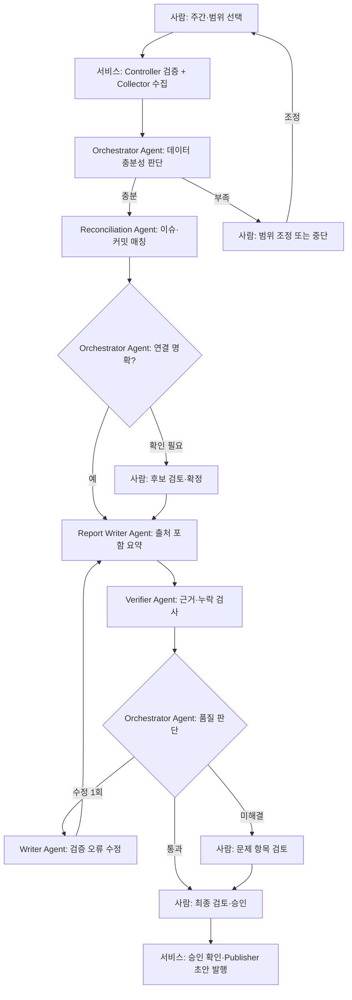

# 2 Week - 문제 정의 및 서비스 기획

## 프로젝트 개요

주간 업무 보고서 작성자가 Jira 이슈와 Git 커밋을 수작업으로 모으고 대조·요약해 Confluence에 등록하는 데 드는 시간과 누락 위험을 줄이려고 합니다.
Jira·Git 데이터를 수집·연결하고, AI가 보고용 요약과 카테고리를 생성하면 사용자가 웹 화면에서 검토·수정한 뒤 Confluence 초안으로 발행합니다. 
목표는 보고서 작성 시간을 2시간 이상에서 1시간 이내로 줄이고, 카테고리 자동 분류 정확도 90% 이상을 달성하는 것입니다.

## 1. 총평

Jira·Git 데이터 수집부터 보고서 작성, 사용자 검토, Confluence 초안 발행까지 흐름이 잘 정의되어 있습니다. 
**실제 업무 시간이 줄었는지**, **Agent가 필요한 판단과 역할을 수행하고 있는지**, **오류와 발행을 안전하게 통제하는지** 등을 발전해 나가시면 좋을 것 같습니다.

정해진 규칙은 Rule-based 로 처리하고, 모호한 연결이나 근거 기반 요약처럼 맥락 판단이 필요한 구간 또는 자동화가 필요한 기능에서 Agent를 활용하면 좋을 것 같습니다.

## 2. 먼저 구체화할 사항

- **문제 기준선**: 데이터 수집, Jira-Git 대조, 작성, 검토에 걸리는 시간 등의 수치화(가급적)
- **성공 지표**: 작성 시간 외에도 업무 포착률, 요약문 수정 부담, 근거 오류율, 발행 성공·중복률 등
- **업무 규칙**: 보고 주간의 시간대, 대상 프로젝트·저장소, 이슈 키 없는 커밋, 여러 이슈에 걸친 커밋, 데이터 간 상태 불일치의 처리 방법 등의 규칙 정의 필요
- **MVP 범위**: 한 팀, 한 Jira 프로젝트, 한 저장소 등 어느 범위까지 MVP 범위로 할 지 결정이 필요

## 3. 권장 Agent 구성

| 구성 요소 | 담당 역할 | 제한 사항 |
|---|---|---|
| Orchestrator Agent | 단계 실행, 상태 관리, 사용자 확인이 필요한 작업의 중단·재개 등 조율| Rule-Base 와 Agent 판단을 어떻게 나눌지 검토 필요 |
| Collector (일반 서비스) | Jira·Git 데이터를 읽고 정규화 | 읽기 전용 |
| Reconciliation Agent | 이슈와 커밋의 모호한 연결을 판단하고 근거·후보를 제시 | 쓰기 권한을 주지 않으며, 불확실한 연결은 반환하여 인간의 판단 또는 조정(HITL)을 획득하는 방안 검토 |
| Report Writer Agent | 확정된 업무 사실을 보고서 문장으로 요약 | 입력에 없는 사실 않고, 출처를 기술 |
| Verifier Agent (선택) | 요약의 과장·모순·근거 누락을 확인 | 결과를 검토 의견으로만 반환하며 직접 수정·발행하지 않음. |
| Publisher (일반 서비스) | 승인된 내용을 Confluence 초안으로 등록 | 사용자 승인과 중복 방지를 코드에서 확인합니다. |

## 4. 권장 Workflow

### 멀티 Agent Workflow (Orchestrator Agent의 판단 중심)

- Orchestrator Agent는 데이터 충분성, 연결의 불확실성, 검증 결과에 따라 진행·사용자 확인·재작성을 결정.
- 재작성은 횟수 제한 필요, 권한·승인·중복 발행은 인간의 승인 등의 강제화가 필요.

- 낮은 확신, 데이터 누락, 상충 정보는 자동 확정하지 말고 검토 대상으로 분류.
- 댓글과 커밋 메시지는 지시가 아니라 분석 데이터로 취급해 프롬프트 인젝션을 방어.
- Confluence 요청이 타임아웃된 경우에는 실패로 단정하여 재호출하지 말고, 초안 생성 여부를 확인한 뒤 재시도 필요.
- 각 요약 문장에서 원본 Jira 이슈·커밋으로 이동할 수 있도록 출처 표기.

단 과정을 근거로 입증하는 것**입니다.
