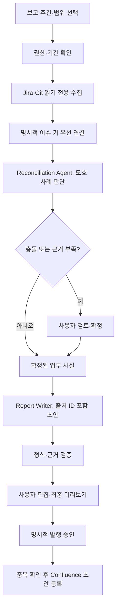

# 2 Week - 문제 정의 및 서비스 기획

## 1. 총평

Jira·Git 데이터 수집부터 보고서 작성, 사용자 검토, Confluence 초안 발행까지 흐름이 잘 정의되어 있습니다. 다음 단계에서는 기능 구현보다 **실제 업무 시간이 줄었는지**, **Agent가 필요한 판단을 맡고 있는지**, **오류와 발행을 안전하게 통제하는지**를 검증해 주시기 바랍니다.

멀티 Agent 자체가 목표가 되어서는 안 됩니다. 정해진 규칙은 일반 코드로 처리하고, 모호한 연결이나 근거 기반 요약처럼 맥락 판단이 필요한 구간에만 Agent를 적용해 주십시오.

## 2. 먼저 구체화할 사항

- **문제 기준선**: 데이터 수집, Jira-Git 대조, 작성, 검토에 걸리는 시간을 나눠 측정해 주십시오. “2시간”에 사람의 검토 시간도 포함하는지 정의해 주시기 바랍니다.
- **성공 지표**: 작성 시간 외에도 업무 포착률, 요약문 수정 부담, 근거 오류율, 발행 성공·중복률을 함께 확인해 주십시오. 분류 평가는 표본과 정답 기준을 정하고, 클래스별 precision/recall도 살펴보시기 바랍니다.
- **업무 규칙**: 보고 주간의 시간대, 대상 프로젝트·저장소, 이슈 키 없는 커밋, 여러 이슈에 걸친 커밋, 데이터 간 상태 불일치의 처리 방법을 정해 주십시오.
- **MVP 범위**: 한 팀, 한 Jira 프로젝트, 한 저장소, 한 보고서 양식으로 시작해 가설을 먼저 검증해 주십시오. 과거 보고서 관리와 상세 댓글 분석은 이후 우선순위를 판단하셔도 좋습니다.

## 3. 권장 Agent 구성

| 구성 요소 | 담당 역할 | 제한 사항 |
|---|---|---|
| Workflow Orchestrator | 단계 실행, 상태 관리, 사용자 확인이 필요한 작업의 중단·재개 | 전체 흐름은 코드 기반으로 통제하고 임의 도구 호출을 허용하지 않습니다. |
| Collector (일반 서비스) | Jira·Git 데이터를 읽고 정규화 | 읽기 전용으로 동작하며, 토큰을 모델에 전달하지 않습니다. |
| Reconciliation Agent | 이슈와 커밋의 모호한 연결을 판단하고 근거·후보를 제시 | 쓰기 권한을 주지 않으며, 불확실한 연결은 `needs_review`로 반환합니다. |
| Report Writer Agent | 확정된 업무 사실을 보고서 문장으로 요약 | 입력에 없는 사실을 만들지 않고, 문장마다 출처 ID를 반환합니다. |
| Verifier Agent (선택) | 요약의 과장·모순·근거 누락을 확인 | 결과를 검토 의견으로만 반환하며 직접 수정·발행하지 않습니다. |
| Publisher (일반 서비스) | 승인된 내용을 Confluence 초안으로 등록 | 사용자 승인과 중복 방지를 코드에서 확인합니다. |

초기에는 **Workflow + Reconciliation Agent + Report Writer Agent**로 시작하시기를 권합니다. Verifier는 품질 향상 효과가 확인될 때 추가하십시오. 단일 Agent와 멀티 Agent를 같은 평가 사례로 비교해 비용·지연을 감수할 만큼 나아지는지 확인해 주시기 바랍니다.

## 4. 권장 Workflow

- 낮은 확신, 데이터 누락, 상충 정보는 자동 확정하지 말고 검토 대상으로 보내 주십시오.
- 댓글과 커밋 메시지는 지시가 아니라 분석 데이터로 취급해 프롬프트 인젝션을 방어해 주십시오.
- Confluence 요청이 타임아웃된 경우에는 실패로 단정해 재호출하지 말고, 초안 생성 여부를 확인한 뒤 재시도해 주십시오.
- 각 요약 문장에서 원본 Jira 이슈·커밋으로 이동할 수 있도록 출처를 보여 주십시오.

## 5. 멘토링 시 확인할 질문

1. 작성 시간 기준선은 어떻게 측정했고, 실제 사용자의 업무를 반영하고 있습니까?
2. 이 단계는 왜 일반 코드가 아니라 Agent 판단이 필요합니까?
3. Agent가 사용할 수 있는 도구와 권한, 멈추고 사용자에게 넘기는 기준은 무엇입니까?
4. 생성된 각 문장의 근거를 사용자가 확인할 수 있습니까?
5. 단일 Agent와 멀티 Agent의 품질·비용 차이를 어떤 사례로 비교하시겠습니까?
6. 발행 실패나 타임아웃 때 중복 초안을 어떻게 방지하시겠습니까?

## 6. 평가 기준 예시

- **비즈니스 문제 해결 35%**: 사용자 근거, 측정 가능한 기준선, 실제 성과 검증
- **Agent 설계 35%**: Agent가 필요한 판단, 도구·권한 경계, 불확실성 처리, 단일/멀티 비교
- **품질·안전성 30%**: 출처 추적, 누락·오류 평가, 개인정보 보호, 승인 및 중복 발행 방지

완성도 높은 데모뿐 아니라 실제 사용자 기준 전후 시간, 수정·오류 사례, Agent 실행 추적, 남은 한계를 함께 평가해 주십시오. 프로젝트의 핵심 성과는 Agent 수가 아니라 **업무 개선 효과와 통제 가능한 판단 과정을 근거로 입증하는 것**입니다.
