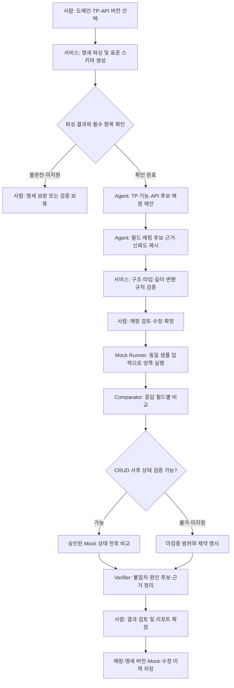

# 2 Week - 문제 정의 및 서비스 기획

## 프로젝트 개요

NOVA/채널서비스 재구축 과정에서 기존 MCG TP(Byte 기반 레거시 인터페이스)를 신규 REST API(JSON 기반)로 전환할 때, 사람이 두 종류의 명세를 읽고 기능·필드 매핑을 작성한 뒤 양쪽 실행 결과를 비교하는 반복 업무를 줄이려는 프로젝트입니다. AI가 TP와 API의 기능·필드 매핑 후보 및 신뢰도·근거를 제시하고, Mock 환경에서 만든 요청·응답을 비교해 정합성 검증 리포트를 생성하는 것을 목표로 합니다.

현재 KPI 목표는 확정 전입니다. 기획서의 기대 효과에는 분석 시간 50% 단축, 정합성 탐지 정확도 90% 이상, 투입 인력 30% 절감이 제시되어 있으므로, 각각의 측정 정의와 실제 기준선을 정한 뒤 목표를 확정해야 합니다. 특히 설계 중인 API 명세와 Mock 검증의 한계를 결과에 명확히 표시해야 합니다.

## 나의 멘토 가이드

이 프로젝트는 단순히 이름이 비슷한 필드를 찾아주는 것보다, TP의 바이트 구조와 API의 JSON 구조가 실제 업무 의미와 데이터 표현까지 같은지를 판단하는 일이 핵심입니다. 따라서 먼저 선정 도메인의 TP와 API 명세를 몇 쌍 골라, 담당자가 현재 어떤 순서로 기능과 필드를 매핑하고 검증하는지 살펴보시면 좋겠습니다. 그 사례를 바탕으로 AI가 추천해도 되는 부분, 규칙으로 검증해야 하는 부분, 담당자가 결정해야 하는 부분을 나누면 Agent의 역할이 자연스럽게 정해집니다.

필드 매핑은 후보와 근거를 제안하는 데 AI를 쓰되, 길이·순서·타입·필수 여부·반복 구조·코드값·인코딩처럼 명세에 직접 정의된 조건은 검증 규칙으로 확인하는 구성이 좋습니다. 특히 Byte와 JSON 사이에는 공백 패딩·절삭, 문자 인코딩, 숫자 표현, 날짜 형식, null·누락·기본값 처리 차이가 생길 수 있습니다. 신뢰도 점수만 보고 자동 확정하지 말고, 어떤 근거로 후보를 골랐는지와 어떤 조건이 맞지 않는지를 함께 보여 주세요.

또 하나 중요한 점은 Mock 결과 비교가 실제 운영 환경의 동등성을 증명하지는 않는다는 것입니다. 같은 샘플 요청을 양쪽 Mock에 넣어 응답을 비교하더라도, Mock이 실제 TP/API 동작을 얼마나 충실히 반영하는지 먼저 확인해야 합니다. Create·Update·Delete는 응답뿐 아니라 실행 후 상태까지 비교해야 의미가 있으므로, MVP에서 가능한 검증 수준을 명확히 정하고 확인하지 못한 항목은 미검증으로 남겨 주세요. 최종 매핑 확정과 전환 의사결정은 담당자와 QA가 할 수 있도록 설계하는 것이 안전합니다.

평가를 위해서는 최종 매핑표와 불일치 건수만 보지 말고, 원본 명세 버전, 추천 후보·근거·신뢰도, 적용한 정규화 규칙, Mock 입력과 양쪽 응답, 비교 결과 및 사람의 수정 이력을 연결해 추적할 수 있어야 합니다. 그래야 잘못된 추천이 명세 해석 문제인지, 변환 규칙 문제인지, Mock 한계인지 구분하고 다음 평가에 반영할 수 있습니다.

## 1. 총평

레거시 TP에서 신규 REST API로 전환할 때 발생하는 실제 부담이 잘 드러나 있습니다. 필드 매핑표 작성에 그치지 않고 As-Is/To-Be를 실행해 결과를 비교하고, CRUD에서는 데이터 변경 후 상태까지 확인해야 한다는 점을 문제로 잡은 것이 좋습니다. 또한 실제 환경 연동이나 자동 코드 변환을 범위 밖으로 두어 PoC의 경계를 설정한 점도 적절합니다.

다음 단계에서는 **선정 도메인과 대표 TP를 구체적으로 고르고**, **필드 정합성의 판정 기준과 예외를 정의하고**, **Mock 검증이 실제 동작을 어느 정도 대표하는지 확인**하는 것이 중요합니다. 명세 파싱·필드 속성 비교·값 변환·응답 차이 계산처럼 기준이 정해지는 작업은 일반 코드와 규칙으로 처리하고, 명세 간 의미적 후보 추천이나 불일치 원인 설명처럼 해석이 필요한 부분에 LLM을 활용하는 구성을 권장합니다. AI의 역할은 매핑 및 검증을 보조하는 것이며, 근거가 부족한 매핑을 자동 확정하거나 실제 전환 완료로 간주하지 않도록 해야 합니다.

## 2. 먼저 구체화할 사항

- **MVP 도메인과 대표 사례**: In Scope의 ‘특정 업무 도메인’이 무엇인지, 첫 검증에 사용할 TP와 API를 몇 건으로 할지 정합니다. 정상 사례뿐 아니라 필드 누락, 타입·길이 변경, 코드값 차이, 오류 응답, CRUD 사례를 포함해 대표성을 확보합니다.
- **명세 입력 형식과 버전**: Copybook과 인터페이스 정의서, REST API 설계 초안의 파일 형식·필수 항목·버전을 정리합니다. API 설계가 바뀌었을 때 이전 매핑 결과를 어떻게 무효화하고 재검증할지도 정해야 합니다.
- **기능 단위 매핑 기준**: TP 한 건과 API 한 건이 항상 일대일로 대응하는지, 하나의 TP가 여러 API로 분리되거나 여러 TP가 하나의 API로 통합될 수 있는지 확인합니다. 후보 없음·복수 후보·부분 대응을 표현할 수 있어야 합니다.
- **필드 정합성 규칙**: 필드명만 비교하지 말고 의미, 순서, 길이, 자료형, 필수 여부, 반복 횟수·중첩 구조, 코드값, 단위, 기본값, 입력·출력 방향을 기준으로 정합니다. Byte 필드의 문자셋·패딩·부호·소수점·날짜 표현과 JSON의 null·생략 처리도 확인해야 합니다.
- **신뢰도와 사람 검토 기준**: 신뢰도 점수가 무엇을 의미하는지 검증 데이터로 보정하고, 낮은 점수·다중 후보·속성 충돌은 검토 대상으로 분류합니다. 점수 하나만으로 자동 매핑을 확정하지 말고 추천 근거와 미확인 조건을 함께 제시합니다.
- **Mock의 대표성**: As-Is TP Mock과 To-Be API Mock이 실제 명세와 어떤 기준으로 일치하는지, Mock 구현의 출처·버전·담당자를 기록합니다. Mock이 제공되지 않거나 실제 동작과 검증되지 않은 항목은 비교 결과를 ‘정합’으로 단정하지 않습니다.
- **CRUD 사후 상태 검증**: Create·Update·Delete의 기대 상태를 무엇으로 확인할지 정합니다. 데이터베이스 연동이 MVP 제약으로 어렵다면 사후 상태 검증은 미지원 또는 제한 검증으로 표시하고, 응답 비교만으로 CRUD 정합성을 주장하지 않습니다.
- **KPI와 기준선**: ‘TP당 매핑 분석 시간’, ‘추천 정확도’, ‘불일치 탐지율’, 기대 효과의 시간 50% 단축·정확도 90%·인력 30% 절감이 각각 무엇을 의미하는지 분리해 정의합니다. 추천 채택률은 정확도와 같지 않으므로 전문가 정답 라벨을 둔 정밀도·재현율, 오탐·미탐, 검토 수정량과 함께 평가하는 방안을 검토합니다.
- **평가 데이터 분리**: 매핑 기준과 프롬프트를 만든 사례와 최종 성능을 평가할 사례를 분리합니다. 전문가가 독립적으로 작성·검토한 기준 매핑을 정답으로 두고, 의견 불일치와 판단 보류 사례를 별도로 기록합니다.

## 3. 권장 Agent 구성

| 구성 요소 | 담당 역할 | 제한 사항 |
|---|---|---|
| Workflow Controller (일반 서비스) | 작업 범위·명세 버전·상태 관리, 단계 실행과 사람 검토 요청 조율 | 승인 상태와 검증 완료 여부는 코드에서 관리합니다. LLM이 단계를 임의로 건너뛰지 않게 합니다. |
| Specification Parser (일반 서비스 우선) | Copybook·인터페이스 정의서·API 명세에서 기능과 필드 구조를 추출해 표준 스키마로 변환 | 파싱 실패·미지원 문법을 명시하고, 추출 결과를 원문 위치와 연결합니다. |
| Function Matching Agent | TP 기능과 API 후보를 의미적으로 비교해 후보·근거·미확인 사항 제시 | 유사한 이름만으로 동일 기능으로 확정하지 않습니다. 복수 후보와 매핑 없음 상태를 허용합니다. |
| Field Mapping Agent | 기능 후보 내 필드 대응을 제안하고 의미·타입·방향·구조 근거를 정리 | 신뢰도는 검토 우선순위 보조값입니다. 길이·타입 등 정형 조건은 규칙 검증 결과와 함께 판단합니다. |
| Mapping Rule Validator (일반 서비스) | 길이, 순서, 타입, 필수 여부, 반복 구조, 코드값, 변환·패딩 등 명시 규칙 검증 | 규칙을 통과했다는 사실만으로 업무 의미까지 동일하다고 단정하지 않습니다. 미정 규칙은 미검증으로 표시합니다. |
| Mock Runner (일반 서비스) | 승인된 샘플 입력으로 As-Is·To-Be Mock을 실행하고 원본 입력·응답을 보관 | Mock 환경·버전·실행 상태를 기록합니다. 실제 운영 또는 테스트 환경의 동작으로 표현하지 않습니다. |
| Comparator / Verifier (일반 서비스 + 선택적 Agent) | 정규화된 응답을 필드별로 비교하고 불일치 유형·위치·근거를 리포트 | 정규화로 차이가 숨겨지지 않도록 원본값과 정규화값을 모두 추적합니다. 추정 원인은 확정 원인과 구분합니다. |
| Human Reviewer | 매핑 확정, 모호한 후보 결정, CRUD 검증 범위와 전환 리스크 판단 | AI 추천 채택 여부와 수정 사유를 남겨 평가 정답 및 개선 데이터로 활용합니다. |

## 4. 권장 Workflow

### 명세 매핑 및 Mock 정합성 검증 흐름

## 고려 필요

- **명세 초안과 확정 스펙을 구별**해야 합니다. API 설계가 진행 중인 경우 매핑 결과에 사용한 문서 버전과 작성 시점을 붙이고, 스펙 변경 후에는 영향받는 매핑·테스트를 다시 실행해야 합니다.
- **Byte와 JSON의 표현 차이를 정규화 규칙으로 명시**해야 합니다. 문자 인코딩, 고정 길이 패딩, 공백 제거, 숫자 부호·소수점, 날짜 포맷, 코드값 변환, 빈 문자열·null·필드 생략은 업무 의미를 바꿀 수 있으므로 임의 정규화하지 않습니다.
- **비교 전에 허용 차이와 의미 차이를 나눠야** 합니다. 순서·표현만 다른 값과 실제 기능 결과가 다른 값을 구분하고, 허용 규칙의 근거와 적용 전후 값을 보고서에서 확인할 수 있어야 합니다.
- **오탐과 미탐을 모두 평가**해야 합니다. 불일치를 많이 잡는 것만으로 품질을 판단하지 말고, 정상 차이를 오류로 표시한 비율과 실제 불일치를 놓친 비율을 함께 봅니다. 추천 채택률만으로 매핑 정확도를 대신하지 않습니다.
- **Mock 실행 결과의 범위를 과장하지 않아야** 합니다. Mock이 실제 TP/API 구현과 일치한다는 근거가 없으면 결과는 ‘Mock 기준 비교’로 표시하고, 운영 정합성 검증과 구분해야 합니다.
- **CRUD 상태 비교의 안전한 경계를 정해야** 합니다. 테스트 데이터의 초기 상태와 정리 절차를 마련하고, 실제 DB나 운영 데이터에 쓰기 요청이 가지 않도록 격리해야 합니다. 상태를 확인하지 못한 작업은 응답 비교만 수행한 것으로 명시합니다.
- **샘플 데이터와 명세의 민감정보를 관리**해야 합니다. 계좌·고객·개인 식별 데이터가 포함되지 않도록 익명화하고, LLM에 전달 가능한 범위와 로그·보존 기간을 정합니다.
- **Agent 입력 문서를 신뢰된 지시로 취급하지 않아야** 합니다. 명세나 예제에 포함된 임의 문구가 시스템 지시를 바꾸지 않도록 데이터와 지시문을 분리하고, 도구 권한은 필요한 읽기·Mock 실행 범위로 제한합니다.
- **최종 매핑과 전환 판단은 담당자가 확정**해야 합니다. 낮은 신뢰도, 상충 명세, 부분 대응, 미검증 CRUD 결과는 자동 통과시키지 말고 QA·개발자 검토 항목으로 남깁니다.
