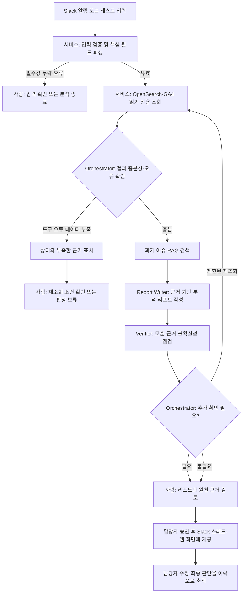

# 2 Week - 문제 정의 및 서비스 기획

## 프로젝트 개요

T ID의 Slack 오류 알림을 받은 운영 담당자가 OpenSearch 로그, GA4 인증 퍼널, 과거 이슈 이력을 각각 확인하고 결과를 종합하는 반복 업무를 줄이려는 프로젝트입니다. 알림에서 채널(`client_id`)과 오류 정보를 추출하고, 각 데이터 소스를 읽기 전용으로 조회한 뒤 근거와 불확실성을 포함한 분석 리포트를 생성합니다.

목표는 이슈 1건당 분석 시간을 현재 대비 70% 이상 단축하고, 원인 유형 분류 및 사용자 영향도 판정 정확도 85% 이상, 리포트 채택률 80% 이상을 검증하는 것입니다. 현재 수준은 임의로 가정하지 말고 실제 업무 사례로 기준선을 측정한 뒤 확정해야 합니다.

## 나의 멘토 가이드

먼저 Agent를 몇 개로 나눌지부터 정하기보다는, Slack 알림이 들어온 뒤 담당자가 어떤 근거를 확인하고 어떤 순간에 판단을 내리는지 시나리오로 구체화해 보시면 좋겠습니다. 입력값 검증이나 OpenSearch·GA4 조회처럼 기준이 분명한 작업은 일반 코드와 도구 호출로 처리하고, 서로 다른 근거를 비교해 원인을 가설로 정리하거나 리포트를 작성하는 단계에 LLM을 활용하는 편이 안정적으로 생각됩니다. 데이터가 부족하거나 로그와 GA4 결과가 엇갈릴 때, 그리고 리포트를 공유하기 전에는 담당자가 확인하고 이어갈 수 있도록 HITL 지점을 설계에 포함하는 것도 고민해 보면 좋을 것 같습니다.

평가할 때는 최종 리포트만 보는 데 그치지 않고, 어떤 데이터를 조회했고 어떤 근거를 바탕으로 결과를 만들었는지 되짚을 수 있도록 실행 Trace를 남기면 좋을 것 같습니다. 조회 시각·기간·필터, 각 단계의 결과 상태와 소요 시간, 재시도 여부를 확인할 수 있으면 오판이나 연동 문제를 찾고 KPI 결과를 해석하는 데 도움이 될 것 같습니다.

## 1. 총평

문제와 사용자가 구체적이고, Slack 알림부터 로그·사용자 행동·과거 사례를 종합해 리포트로 전달하는 업무 흐름이 잘 잡혀 있습니다. 특히 채널별 이슈인지 T ID 전반의 문제인지, 실제 사용자 영향이 있는지를 함께 확인하려는 방향이 좋습니다.

다음 단계에서는 **데이터가 실제로 채널 단위 분석을 지원하는지**, **영향도와 원인 유형을 어떤 규칙으로 판정할지**, **Agent의 분석 결과를 어떤 사례로 검증할지**를 먼저 확인하면 좋겠습니다. 정형 데이터 조회·집계·입력 검증은 일반 코드로 처리하고, 원인 가설 정리·유사 사례 비교·근거 중심 자연어 요약에 LLM을 활용하는 구성을 권장합니다. Agent가 장애를 확정하거나 자동 조치하는 것이 아니라, 담당자의 판단을 돕는 PoC로 범위를 유지해야 합니다.

## 2. 먼저 구체화할 사항

- **업무 기준선**: 알림 접수부터 근거 확인·원인 정리·공유까지 현재 걸리는 시간을 실제 사례로 측정합니다. 알림 유형과 분석 범위도 함께 기록합니다.
- **데이터 가용성**: OpenSearch의 인덱스·필드·시간대, GA4의 인증 이벤트와 `client_id` 커스텀 차원 수집 여부, 데이터 지연 및 표본 규모를 확인합니다. 채널 식별이 불가능한 경우에는 분석 불가로 처리해야 합니다.
- **판정 규칙**: 원인 유형 분류 체계, 영향도 단계, 비교 기간·기준, 최소 표본 조건, ‘판정 보류’ 기준을 운영 담당자와 합의합니다. 로그 오류 증가만으로 사용자 영향이나 원인을 확정하지 않습니다.
- **테스트·정답 데이터**: 과거 이슈에서 실제 원인·영향 여부·근거가 확인된 사례를 확보하고, 개발용과 최종 평가용을 분리합니다. 라벨이 불명확한 사례는 정답 데이터에서 별도로 구분합니다.
- **MVP 범위**: 8주 PoC에서는 Slack 알림 입력, OpenSearch·GA4 조회, 과거 이력 검색, 리포트 확인까지를 우선 완성합니다. Grafana 연동과 사전 이상 감지는 핵심 흐름 검증 이후 확장 항목으로 둡니다.
- **성공 지표 정의**: 시간 단축의 시작·종료 시점, 분류 정확도의 라벨 기준, 영향도 판정의 담당자 기준, 리포트 채택률의 ‘경미한 수정’ 정의를 정하고 표본 수와 함께 결과를 보고합니다.

## 3. 권장 Agent 구성

| 구성 요소 | 담당 역할 | 제한 사항 |
|---|---|---|
| Orchestrator (LangGraph) | 단계 실행, 상태 관리, 결과 충분성·상충 여부 확인, 제한된 재조회 및 사람 검토 분기 | 재시도·반복 횟수와 종료 조건을 코드로 제한합니다. 명확한 규칙을 불필요하게 LLM 판단에 맡기지 않습니다. |
| Alert Parser (일반 서비스 우선) | Slack 알림에서 에러 코드, 발생 시간, `client_id` 등 추출 및 입력 검증 | 필수값 누락·형식 오류를 추측해 채우지 않고 검토 또는 분석 불가로 반환합니다. |
| Log Analysis (조회 노드/도구) | OpenSearch MCP로 채널별 오류 추이, 최초 발생 시점, 타 채널 동시 발생 여부 조회 | 읽기 전용·최소 권한, 허용된 인덱스와 기간만 조회합니다. 출처·조회 조건을 결과에 포함합니다. |
| Impact Analysis (조회 노드/도구) | GA4 MCP로 채널별 인증 퍼널 및 기준 기간 대비 변화를 확인 | GA4 집계값을 개인·트랜잭션 단위 사실로 해석하지 않습니다. 표본 부족·지연·차원 누락이면 판정을 보류합니다. |
| Historical Case Retrieval | 과거 이슈에서 유사 사례와 당시 원인·조치 결과를 검색 | 유사도만으로 원인을 확정하지 않습니다. 검색된 사례의 출처와 유사하다고 본 이유를 제시합니다. |
| Report Writer Agent | 로그·GA4·과거 사례를 종합해 원인 가설, 영향도, 권장 확인 항목을 근거와 함께 요약 | 입력에 없는 사실을 만들지 않고 관측 사실·해석·가설·불확실성을 구분합니다. 권고는 자동 조치가 아닙니다. |
| Verifier (선택) | 리포트의 근거 누락, 모순, 데이터 출처·시간 범위 표기 여부 검토 | 통과/검토 의견만 반환합니다. 검증 결과를 근거 없이 덮어쓰거나 자동 확정하지 않습니다. |
| API·화면·공유 서비스 | FastAPI 입력 검증, Streamlit 결과·근거 표시, 승인된 리포트 전달 | 도구 자격 증명과 민감정보를 화면·로그에 노출하지 않습니다. 외부 공유는 담당자 검토를 거치게 합니다. |

## 4. 권장 Workflow

### 분석 및 사람 검토 흐름

## 고려 필요

- **‘영향 없음’과 ‘확인 불가’를 구분**해야 합니다. 조회 결과가 없거나 GA4 데이터가 늦게 들어온 상황은 정상의 증거가 아닙니다. `영향 가능성 높음/있음`, `현재 근거에서 영향 확인 안 됨`, `판정 보류`처럼 보수적인 상태를 검토해 보세요.
- **비교 조건을 고정**해야 합니다. OpenSearch와 GA4의 시간대, 조회 구간, 기준 기간, 채널 필터가 맞지 않으면 결론이 흔들립니다. 리포트에 조회 시각·기간·필터·표본 정보를 포함하는 것이 좋습니다.
- **지표의 의미를 혼합하지 않아야** 합니다. 로그 건수와 GA4 전환율은 서로 다른 단위이므로, 한쪽의 변화만으로 실제 사용자 영향이나 근본 원인을 단정하지 않습니다.
- **RAG 이력의 품질과 보안**을 관리해야 합니다. Slack 스레드의 미확정 추측이나 개인정보가 그대로 검색되지 않도록 이슈별로 검증된 원인·근거·조치 결과를 정리하고 마스킹합니다.
- **재조회는 목적과 상한이 있어야** 합니다. 어떤 근거가 부족할 때 어떤 범위를 추가 조회할지 정하고, 반복 횟수·시간·비용을 제한합니다. 증거가 상충하면 무조건 반복 호출하기보다 사람 검토로 넘깁니다.
- **읽기 전용 원칙을 유지**해야 합니다. OpenSearch·GA4 접근 계정은 최소 권한으로 제한하고, 장애 조치·설정 변경·재시작 등 쓰기 작업은 범위 밖으로 둡니다.
- **부분 실패를 숨기지 않아야** 합니다. OpenSearch 성공·GA4 실패처럼 일부 결과만 있는 경우 완전 분석으로 표시하지 말고, 분석 상태와 결측 출처를 화면 및 리포트에 명시합니다.
- **Slack 발행은 중복과 오발송을 통제**해야 합니다. PoC에서는 담당자 검토 후 공유하는 흐름을 우선하고, 자동 전송을 구현하더라도 대상 채널 확인과 중복 방지 기준을 코드로 강제합니다.
- **평가는 정확도 하나로 끝내지 않습니다.** KPI별 분모·표본 수와 함께 오분류 유형, 판정 보류율, 리포트 수정 수준도 살펴 목표 수치가 안전성과 함께 달성되는지 확인합니다.

